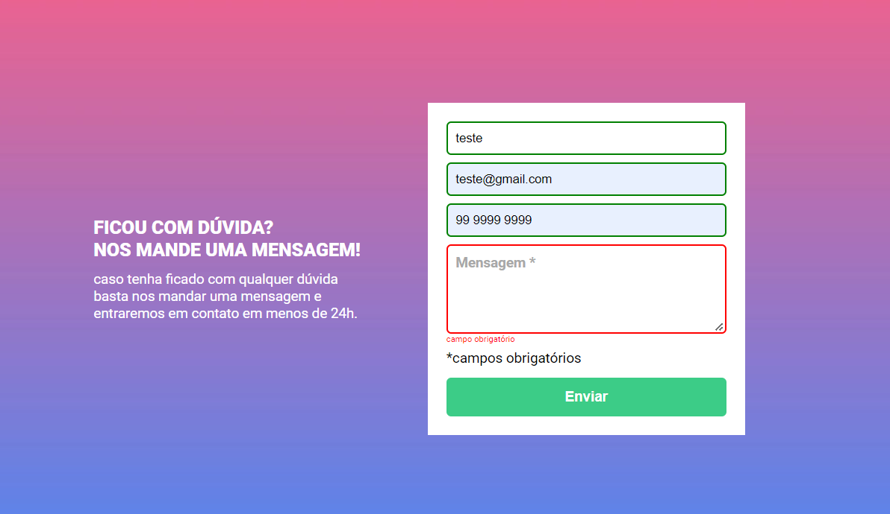

<h1 align="center"> Formulário com validação de dados </h1>

 

  

## 🚀 Tecnologias

Esse projeto foi desenvolvido com as seguintes tecnologias:

- HTML e CSS
- JavaScript
- Git e Github

## 💻 Projeto

Desafio do DevQuest em fazer um formulário com validação de dados utilzando HTML, CSS, JS. O layout do projeto com as medidas foi apresentado através do Figma. Talvez o maior desafio tenha sido fazer aparecer a mensagem de erro quando o usuário não preenche algum dos inputs.

## 🔖 Dasafios

- Reproduzir o layout do Figma em códigos
- Colocar as mensagens de erro pelo JS

---